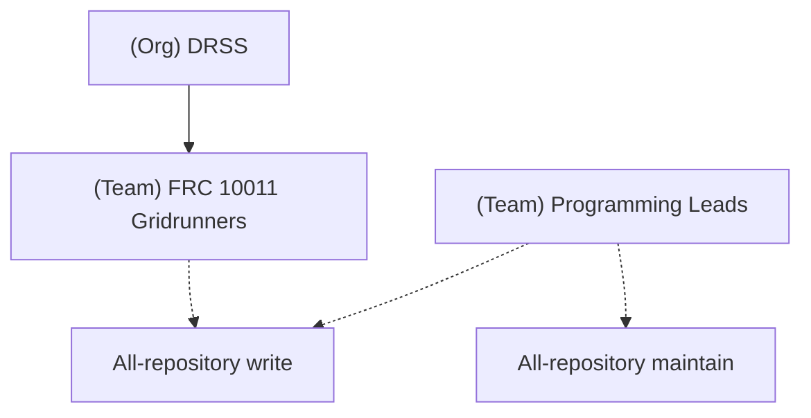

# GitHub Team Administration

## Teams and Roles Overview
The [DRSS Organization](https://github.com/organizations/DRSS-Robotics) contains the [FRC 10011 Gridrunners](https://github.com/orgs/DRSS-Robotics/teams/frc-10011-gridrunners) team, representing general team members, and [Programming Leads](https://github.com/orgs/DRSS-Robotics/teams/programming-leads), representing coaches, mentors, and student leads.  Repositories are assigned access at the team level; for example, [GemScout-FrontEnd](https://github.com/DRSS-Robotics/GemScout-Frontend) has granted _write_ access to FRC 10011, and _maintain_ to Programming Leads.

## Adding new users
1. Go to https://github.com/orgs/DRSS-Robotics/teams/frc-10011-gridrunners
2. "Add a member"
3. Search for the username -> "Invite to this organization and team"
4. After invite is accepted, users will have default roles for FRC 10011 repos.
5. Student team leads -> see below.
6. Coaches/mentors -> owner at org level.

## Adding a repo to a team
1. Go to the team repositories page: https://github.com/orgs/DRSS-Robotics/teams/frc-10011-gridrunners/repositories
2. "Add repository"
3. Search for the repo name -> "Add repository to team"
4. Change the "Role" to "Write" (applies to all members on the team)

## Managing student leads
1. Add or remove programming leads (including sub-team leads) to https://github.com/orgs/DRSS-Robotics/teams/programming-leads (nested under the 10011 team)
2. Repos have Maintain role

## Removing users
1. Go to https://github.com/orgs/DRSS-Robotics/people
2. Find the user to remove
3. Go to the kebab menu on the right -> "Remove from organization..."
4. Click the confirmation to remove.

Multiple members can be removed at once by checking the box next to their username, then clicking the drop-down box at the top for "# members selected".
